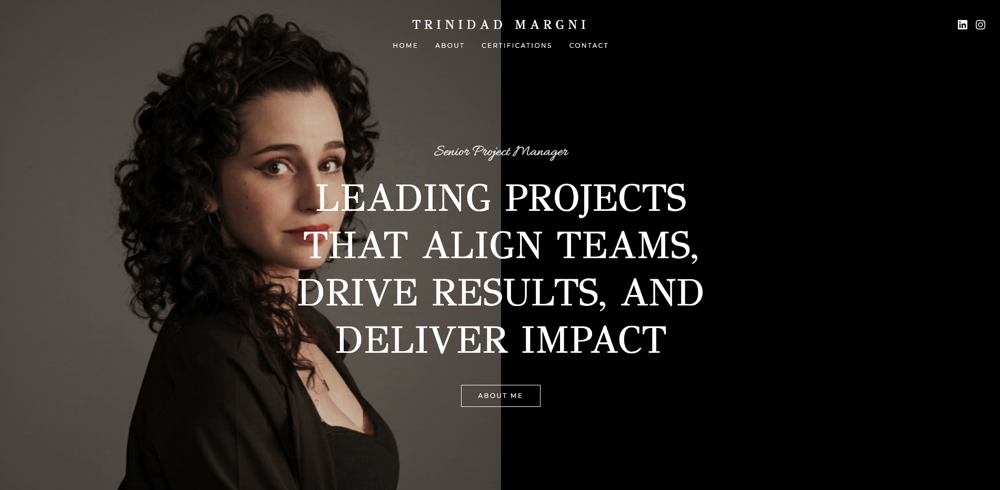

<div align="center">

# Trinidad Margni — Portfolio

**The personal site of a Senior Project Manager, written in Rust and compiled to WebAssembly — one binary, no JavaScript framework, served as a static bundle.**

[](LICENSE)
[](https://www.rust-lang.org/)
[](https://leptos.dev/)
[](https://tailwindcss.com/)
[](https://trunkrs.dev/)
[](https://www.netlify.com/)

[](https://github.com/JoaccoG/trinidad-margni-portfolio/actions/workflows/build.yml)
[](https://github.com/JoaccoG/trinidad-margni-portfolio/actions/workflows/test.yml)
[](https://github.com/JoaccoG/trinidad-margni-portfolio/actions/workflows/audit.yml)

**[▶ trinidadmargni.com](https://trinidadmargni.com)**



</div>

---

> A portfolio site is a solved problem. This one is solved in Rust.

**Trinidad Margni** is a Senior Project Manager who has led delivery for YouTube and United Airlines. This is her site: a single-page editorial layout, a filterable wall of 78 certifications, three downloadable résumés, and a contact form that reaches her inbox.

None of it runs on React. The whole front end is Rust — [Leptos](https://leptos.dev/) in client-side rendering mode, compiled to `wasm32-unknown-unknown`, bundled by [Trunk](https://trunkrs.dev/), and shipped to Netlify as static files plus one serverless function. The choice was deliberate: fine-grained reactivity without a virtual DOM, the compiler catching template mistakes at build time, and a dependency tree that doesn't move under you.

## What ships

Measured on the release build (`trunk build --release`, `opt-level = "z"` + LTO), before and after compression:

| asset | raw | gzip | brotli |
|:--|--:|--:|--:|
| WebAssembly | 545 KB | 212 KB | 174 KB |
| JS glue | 49 KB | 8.4 KB | 7.1 KB |
| CSS | 57 KB | 8.6 KB | 7.2 KB |
| **total** | **651 KB** | **229 KB** | **189 KB** |

189 KB over the wire for a complete client-rendered app — in the same range as an equivalent React build, which is the honest comparison. The WebAssembly also carries the entire certification dataset baked in (see below), so it is doing more than rendering. The point of Rust here was never to win a size benchmark; it was to get a type-checked UI with no runtime surprises.

## What's on it

**Home** — a full-viewport hero, an about section with the résumé dropdown, an infinite marquee of the companies she has worked with, a preview of her certifications, and the contact form.

**`/certifications`** — the full wall: **78 certifications across 6 categories** (Project Management & CSM, Artificial Intelligence, Web Development, Digital Marketing, Product Management & e-Commerce, Communications). The data lives as JSON under `public/data/certs/`, one bundle per category, and is pulled into the binary at compile time with `include_str!` — so there is no fetch, no loading state, and a malformed bundle is a build failure rather than a blank section. Filtering is driven by the URL (`/certifications?category=artificial-intelligence`), which makes any filtered view a shareable link.

**Résumés** — English, Spanish, and a Harvard-format, AI-friendly version, served straight from `public/files/`.

## The contact form

There is no third-party form widget and no API key in the browser. The form posts to a [Netlify Function](netlify/functions/contact.mjs) that validates the payload, drops honeypot submissions, HTML-escapes both fields, and hands the message to [Resend](https://resend.com/). Method, JSON shape, email format, and both field lengths are all checked server-side; the key lives only in the Netlify environment.

## Checked, not trusted

Quality gates run in three places, and they run the same commands.

**Git hooks** ([`.githooks/`](.githooks), wired through `core.hooksPath`) — `pre-commit` blocks on `cargo fmt --check` and `cargo clippy -- -D warnings`; `pre-push` additionally validates the branch name (`feature/…` or `bug/…`), runs a release build, and runs the tests.

**GitHub Actions** — three workflows on every pull request: a production build, the WASM browser tests, and a code audit.

**The lints are strict on purpose.** `unsafe_code` is denied outright, and Clippy runs with `pedantic` + `nursery` promoted to warnings, all of which are denied in CI. Browser behaviour is covered by [`tests/app_test.rs`](tests/app_test.rs) — real assertions against a real DOM, executed by `wasm-bindgen-test` in headless Chrome.

## Running locally

One-time setup — checks the Rust toolchain, adds the `wasm32-unknown-unknown` target, installs Trunk and leptosfmt, warms the dependency cache, and points git at the repo's hooks:

```bash
./scripts/setup.sh
```

Then:

```bash
trunk serve --open      # http://localhost:3000
```

```bash
trunk build --release   # production bundle → dist/
```

The full gate, in the order the hooks run it:

```bash
cargo fmt                            # format (leptosfmt for view! macros)
cargo clippy --all-targets -- -D warnings
cargo test                           # native unit tests
wasm-pack test --headless --chrome   # browser integration tests
```

> `wasm-pack` downloads a ChromeDriver matching the latest Chrome. If your installed Chrome is older, point it at a matching driver with `CHROMEDRIVER=/path/to/chromedriver`.

## Environment

The contact function needs three variables — locally in `.env`, in production in the Netlify dashboard. See [`.env.example`](.env.example):

```bash
RESEND__API_KEY=re_your_api_key_here
EMAILS__FROM=Portfolio Contact <contact@mail.yourdomain.com>
EMAILS__TO=recipient@example.com
```

## Layout

```
src/
  components/     one component per file — hero, about, companies, certifications, contact, footer, header
  pages/          home, certifications, not_found
  data/           certification loading and types
  site_links.rs   shared nav labels and external URLs
public/
  data/certs/     the certification index + one JSON bundle per category
  files/          cv-en.pdf · cv-es.pdf · cv-ai-friendly.pdf
  assets/         images and icons
netlify/functions/
  contact.mjs     the contact form endpoint
tests/app_test.rs headless-browser integration tests
```

## Built with

**Rust** (edition 2024) · **Leptos 0.8** CSR with `leptos_router` and `leptos_meta` · **Tailwind CSS v4** · **Trunk** · **Netlify** static hosting and Functions · **Resend** for transactional email. Typefaces are GFS Didot, Montserrat, and Allura.

## License

[MIT](LICENSE) © 2026 Joaquín Godoy — design and engineering. Site content, imagery, and résumés belong to Trinidad Margni.
